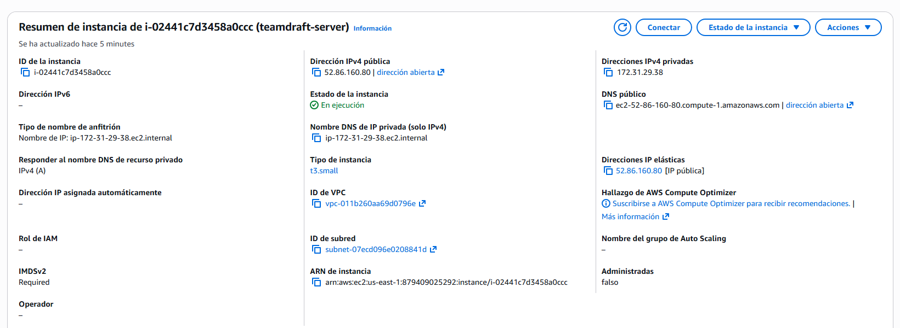
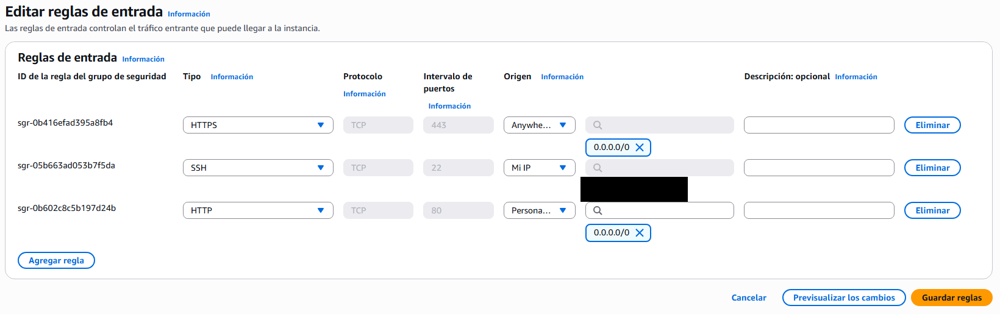
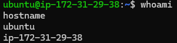
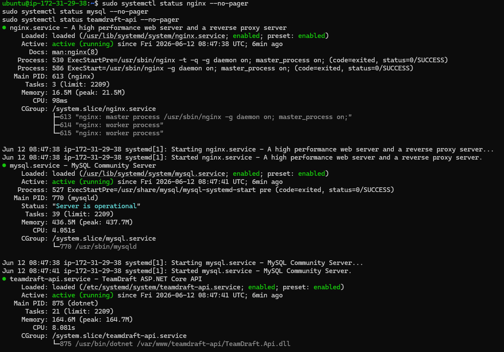
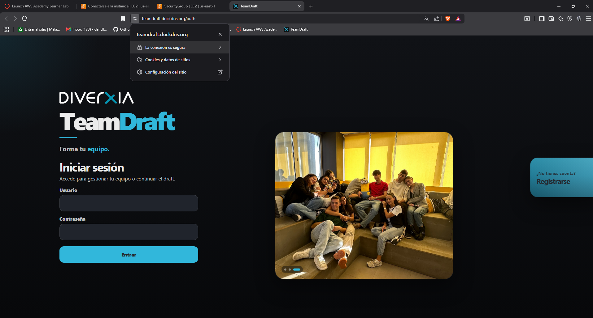

# Despliegue de TeamDraft en AWS

## 1. Resumen del despliegue

TeamDraft se ha desplegado en **AWS Academy Learner Lab** utilizando una instancia **EC2 Ubuntu**. La aplicación queda accesible públicamente mediante **HTTPS** a través del dominio gratuito de DuckDNS:

```text
https://teamdraft.duckdns.org
```

La arquitectura utilizada es:

```text
Usuario
  ↓ HTTPS
DuckDNS
  ↓
Elastic IP 52.86.160.80
  ↓
Nginx
  ├── Frontend React compilado
  ├── Reverse proxy /api → ASP.NET Core Web API
  ├── Reverse proxy /images → recursos estáticos del backend
  └── Reverse proxy /uploads → fotos subidas por usuarios
       ↓
ASP.NET Core Web API
       ↓
MySQL local en EC2
```

## 2. Requisitos mínimos cubiertos

| Requisito | Implementación realizada |
|---|---|
| Despliegue obligatorio en AWS | Despliegue realizado en AWS Academy Learner Lab |
| Uso de al menos una instancia EC2 | Instancia `teamdraft-server` en Amazon EC2 |
| No uso de Beanstalk ni servicios administrados | Se ha configurado manualmente EC2, Nginx, MySQL, .NET y Node.js |
| Servidor web y/o aplicación con recursos integrados | Nginx + ASP.NET Core Web API + MySQL en la misma EC2 |
| IP elástica asignada | Elastic IP `52.86.160.80` asociada a la instancia |
| Acceso mediante SSH | Acceso por SSH con clave privada `.pem` |
| Funcionamiento en HTTPS | Certificado HTTPS configurado con Certbot y Let’s Encrypt |

## 3. Instancia EC2 e IP elástica

La aplicación se ejecuta en una instancia EC2 llamada `teamdraft-server`, con Ubuntu como sistema operativo y una Elastic IP asociada.



## 4. Grupo de seguridad

El grupo de seguridad permite el tráfico necesario para el despliegue:

- Puerto **22 SSH** restringido a mi IP.
- Puerto **80 HTTP** abierto para redirección y validación de certificados.
- Puerto **443 HTTPS** abierto para acceso público a la aplicación.



## 5. Acceso SSH

La administración de la instancia se realiza mediante SSH desde Ubuntu/WSL usando una clave privada `.pem`.

Comando utilizado:

```bash
ssh -i ~/.ssh/teamdraft-key.pem ubuntu@52.86.160.80
```

Comprobación dentro de la instancia:

```bash
whoami
hostname
```



## 6. Servicios instalados en la instancia

En la instancia se han instalado y configurado los siguientes servicios:

- **Nginx**, como servidor web y reverse proxy.
- **MySQL**, como sistema gestor de base de datos.
- **ASP.NET Core Web API**, ejecutado como servicio `systemd`.
- **Node.js / npm**, usado para compilar el frontend React.
- **Certbot**, usado para configurar HTTPS.

Comprobación de servicios:

```bash
sudo systemctl status nginx --no-pager
sudo systemctl status mysql --no-pager
sudo systemctl status teamdraft-api --no-pager
```



## 7. Backend ASP.NET Core

El backend se publicó en:

```text
/var/www/teamdraft-api
```

Publicación realizada con:

```bash
cd ~/apps/proyectosintegrados-MrAndrino/backend/TeamDraft.Api
dotnet publish -c Release -o /var/www/teamdraft-api
```

El backend se configuró como servicio `systemd` para que pueda arrancar automáticamente al iniciar la instancia:

```ini
[Unit]
Description=TeamDraft ASP.NET Core API
After=network.target mysql.service

[Service]
WorkingDirectory=/var/www/teamdraft-api
ExecStart=/usr/bin/dotnet /var/www/teamdraft-api/TeamDraft.Api.dll
Restart=always
RestartSec=10
KillSignal=SIGINT
SyslogIdentifier=teamdraft-api
User=ubuntu
Environment=ASPNETCORE_ENVIRONMENT=Production
Environment=ASPNETCORE_URLS=http://localhost:5000

[Install]
WantedBy=multi-user.target
```

Comandos usados:

```bash
sudo systemctl daemon-reload
sudo systemctl enable teamdraft-api
sudo systemctl start teamdraft-api
sudo systemctl status teamdraft-api
```

## 8. Base de datos MySQL

Se instaló MySQL localmente en la instancia EC2. Se creó una base de datos específica para TeamDraft:

```sql
CREATE DATABASE teamdraft_db CHARACTER SET utf8mb4 COLLATE utf8mb4_unicode_ci;
CREATE USER 'teamdraft_user'@'localhost' IDENTIFIED BY '********';
GRANT ALL PRIVILEGES ON teamdraft_db.* TO 'teamdraft_user'@'localhost';
FLUSH PRIVILEGES;
```

Después se aplicaron las migraciones de Entity Framework Core:

```bash
cd ~/apps/proyectosintegrados-MrAndrino/backend/TeamDraft.Api
ASPNETCORE_ENVIRONMENT=Production dotnet ef database update --configuration Release --no-build
```

Tablas principales generadas:

- `Users`
- `Teams`
- `Picks`
- `SystemStates`
- `__EFMigrationsHistory`

## 9. Frontend React

El frontend React se compiló en producción desde la carpeta `frontend`:

```bash
cd ~/apps/proyectosintegrados-MrAndrino/frontend
npm install
npm run build
```

El resultado de compilación se copió a la carpeta pública usada por Nginx:

```bash
sudo mkdir -p /var/www/teamdraft-client
sudo rm -rf /var/www/teamdraft-client/*
sudo cp -r ~/apps/proyectosintegrados-MrAndrino/frontend/dist/* /var/www/teamdraft-client/
```

Para producción se creó el archivo `.env.production` con la API relativa al mismo dominio:

```env
VITE_API_BASE_URL=
```

De esta manera, el frontend llama a rutas como `/api/auth/login`, que Nginx redirige internamente al backend.

## 10. Configuración de Nginx

Nginx sirve el frontend y redirige las rutas de API e imágenes al backend ASP.NET Core:

```nginx
server {
    server_name teamdraft.duckdns.org 52.86.160.80;

    root /var/www/teamdraft-client;
    index index.html;

    location / {
        try_files $uri $uri/ /index.html;
    }

    location /api/ {
        proxy_pass http://localhost:5000/api/;
        proxy_http_version 1.1;
        proxy_set_header Host $host;
        proxy_set_header X-Real-IP $remote_addr;
        proxy_set_header X-Forwarded-For $proxy_add_x_forwarded_for;
        proxy_set_header X-Forwarded-Proto $scheme;
    }

    location /images/ {
        proxy_pass http://localhost:5000/images/;
        proxy_http_version 1.1;
        proxy_set_header Host $host;
        proxy_set_header X-Real-IP $remote_addr;
        proxy_set_header X-Forwarded-For $proxy_add_x_forwarded_for;
        proxy_set_header X-Forwarded-Proto $scheme;
    }

    location /uploads/ {
        proxy_pass http://localhost:5000/uploads/;
        proxy_http_version 1.1;
        proxy_set_header Host $host;
        proxy_set_header X-Real-IP $remote_addr;
        proxy_set_header X-Forwarded-For $proxy_add_x_forwarded_for;
        proxy_set_header X-Forwarded-Proto $scheme;
    }
}
```

## 11. Dominio DuckDNS y HTTPS

Se creó el dominio gratuito:

```text
teamdraft.duckdns.org
```

Este dominio apunta a la Elastic IP de la instancia:

```text
52.86.160.80
```

El certificado HTTPS se configuró con Certbot y Let’s Encrypt:

```bash
sudo apt install certbot python3-certbot-nginx -y
sudo certbot --nginx -d teamdraft.duckdns.org
```

La aplicación queda accesible mediante HTTPS:

```text
https://teamdraft.duckdns.org
```



## 12. Limitación de AWS Academy Learner Lab

El despliegue se ha realizado dentro de AWS Academy Learner Lab. Este entorno conserva la instancia y los recursos, pero al finalizar la sesión del laboratorio la instancia EC2 queda detenida. Para volver a usar la aplicación es necesario iniciar el laboratorio y arrancar manualmente la instancia EC2.

Al volver a iniciar la instancia, los servicios principales se levantan automáticamente gracias a `systemd`:

```bash
sudo systemctl status nginx
sudo systemctl status mysql
sudo systemctl status teamdraft-api
```

## 13. Comprobaciones finales

Se comprobaron los siguientes puntos:

- La aplicación carga desde `https://teamdraft.duckdns.org`.
- HTTP redirige a HTTPS.
- El login funciona correctamente.
- El registro de usuarios funciona correctamente.
- Las fotos subidas se guardan en `/uploads/photos` y se sirven mediante Nginx.
- El backend responde a las rutas `/api` mediante reverse proxy.
- MySQL contiene las tablas generadas por las migraciones de Entity Framework Core.
- Los servicios `nginx`, `mysql` y `teamdraft-api` están activos.

## 14. Comandos de mantenimiento

Consultar estado del backend:

```bash
sudo systemctl status teamdraft-api
```

Reiniciar backend:

```bash
sudo systemctl restart teamdraft-api
```

Consultar estado de Nginx:

```bash
sudo systemctl status nginx
```

Recargar Nginx tras cambios de configuración:

```bash
sudo nginx -t
sudo systemctl reload nginx
```

Consultar estado de MySQL:

```bash
sudo systemctl status mysql
```

Actualizar código desde GitHub:

```bash
cd ~/apps/proyectosintegrados-MrAndrino
git pull
```
